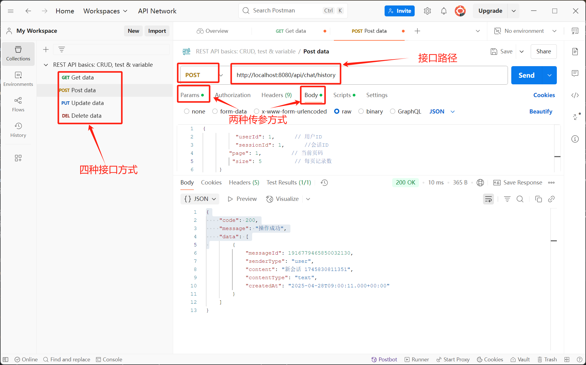

# 智能软件工程辅导教学助手

## 项目简介
本项目是一个基于 **Spring Boot** 开发的后端系统，旨在为软件工程课程提供 AI 辅导支持。项目包括多个模块，涉及智能体（agent）、用户管理（user）和对话处理（chat）。系统通过智能体与用户的交互，帮助学生解决学习过程中遇到的问题。

## 技术栈
- **Spring Boot**：后端框架，负责应用的整体架构和控制器层。
- **Spring Data JPA / MyBatisPlus**：用于数据库访问层。
- **MySQL**：作为数据库管理系统。
- **Redis**：用于缓存处理(目前尚未实现)。
- **其他依赖**：如日志系统、消息队列等。

## 项目结构
```plaintext
├── src
│   ├── main
│   │   ├── java
│   │   │   ├── com.ustb.smartse
│   │   │   │   ├── api
│   │   │   │   │   ├── llm
│   │   │   │   │   │   └── dto
│   │   │   │   │   └── vision
│   │   │   │   ├── common
│   │   │   │   │   ├── constant
│   │   │   │   │   ├── exception
│   │   │   │   │   └── utils
│   │   │   │   ├── config
│   │   │   │   ├── modules
│   │   │   │   │   ├── agent
│   │   │   │   │   │   ├──controller
│   │   │   │   │   │   ├──dto
│   │   │   │   │   │   ├──entity
│   │   │   │   │   │   ├──mapper
│   │   │   │   │   │   └──service
│   │   │   │   │   │      └──impl
│   │   │   │   │   ├── chat
│   │   │   │   │   │   ├──controller
│   │   │   │   │   │   ├──dto
│   │   │   │   │   │   ├──entity
│   │   │   │   │   │   ├──mapper
│   │   │   │   │   │   └──service
│   │   │   │   │   │      └──impl
│   │   │   │   │   ├── user
│   │   │   │   │   │   ├──controller
│   │   │   │   │   │   ├──dto
│   │   │   │   │   │   ├──entity
│   │   │   │   │   │   ├──mapper
│   │   │   │   │   │   └──service
│   │   │   │   │   │      └──impl
│   │   └──resources
```
## 项目架构介绍

该项目采用 **Spring Boot** 作为框架，整体架构遵循分层设计，旨在实现模块化、解耦和可扩展性。系统的核心模块包括智能体、用户管理、对话处理等，分别实现不同的功能需求。

### 1. **模块划分**
项目中的功能被划分为多个模块，每个模块承担不同的职责，方便开发和维护。

- **api**：该模块包含与外部交互的接口，负责定义所有与前端、外部服务或其他微服务交互的 API。`llm` 模块处理与大语言模型（如 OpenAI）相关的请求，`vision` 模块处理与图片识别的 API（暂未实现）。

- **common**：包含项目中的常量、异常处理、工具类等公共功能。`constant` 包含项目中需要使用的常量定义，`exception` 处理全局的异常管理，`utils` 包含常用的工具类。

- **config**：存放项目的配置文件，例如数据库、缓存配置、第三方服务接入配置等。

- **modules**：这是项目的核心业务逻辑所在部分，包含了与用户、聊天、智能体相关的所有功能：
    - **agent**：该模块负责处理智能体的核心业务，包括与 AI 模型的交互。
    - **chat**：负责处理用户和系统之间的对话、聊天历史记录的管理、聊天消息的发送和接收等。包含多个子模块：`controller`、`dto`、`entity`、`mapper`、`service`，每个子模块都处理不同的责任。
    - **user**：负责用户的注册、登录、会话管理等功能，确保用户身份验证和权限控制。

- **SmartSeApplication.java**：项目的入口类，包含 `main` 方法，启动整个 Spring Boot 应用。

### 2. **模块结构与职责**
项目的每个模块具有清晰的职责划分：
- **controller**：负责接收和处理来自前端的 HTTP 请求，协调各个层次的操作，是与前端进行交互的层级。
- **dto**：数据传输对象（DTO），用于与外部系统或前端进行数据交换，避免直接暴露实体对象，并将需要的数据传递给客户端。
- **entity**：包含实体类，通常与数据库表一一对应，负责数据持久化。
- **mapper**：处理数据库的 CRUD 操作，通过 MyBatis 或 JPA 等框架与数据库进行交互。
- **service**：服务层，包含具体的业务逻辑和核心操作，提供控制器和数据持久层之间的交互。
- **impl**：服务层的实现类，负责实际的业务逻辑处理。

### 3. **核心组件**
- **Spring Boot**：作为项目的框架，提供了快速开发、内嵌服务器支持、自动配置等功能，简化了项目开发。
- **Spring Data JPA / MyBatis**：用于数据库操作，MyBatis 提供了灵活的 SQL 映射功能，Spring Data JPA 则简化了数据库的持久化操作。
- **MySQL**：作为数据库，存储系统中的所有数据（如用户信息、聊天记录等）。
- **Redis**：暂时未实现，但可用于缓存处理，提高系统性能，尤其是在处理高并发请求时。

### 4. **依赖关系**
- **Spring Boot** 框架通过依赖注入（DI）管理所有的组件和服务，确保各个模块之间松耦合。
- **控制层（Controller）** 与 **服务层（Service）** 之间通过接口进行交互，确保了模块的高内聚和低耦合。
- **服务层** 调用 **数据访问层（Mapper）**，通过 JPA 或 MyBatis 进行数据库操作。
- **DTO** 用于 **Controller** 和 **Service** 之间的数据交换，避免直接暴露数据库实体数据。

## 向量数据库配置说明

本项目支持两种向量存储方式：
1. 内存向量存储（默认）
2. Milvus向量数据库（需要Docker环境）

### 内存向量存储（默认）

默认情况下，项目使用内存向量存储，无需额外配置。这种方式适合开发和测试环境，但数据会在应用重启后丢失。

### Milvus向量数据库

如果需要使用Milvus向量数据库，请按照以下步骤操作：

1. 确保已安装Docker和Docker Compose
2. 在项目根目录下运行以下命令启动Milvus服务：
   ```bash
   docker-compose up -d
   ```
3. 修改`application.properties`文件中的Milvus配置：
   ```properties
   # 启用Milvus
   langchain4j.milvus.enabled=true
   langchain4j.milvus.host=localhost
   langchain4j.milvus.port=19530
   langchain4j.milvus.collection-prefix=smartse_
   langchain4j.milvus.embedding-dimension=1536
   ```

### 注意事项

由于protobuf版本冲突问题，直接在应用中使用Milvus客户端可能会导致错误。我们提供了以下解决方案：

1. 使用条件Bean配置，允许在不同环境中灵活切换存储方式
2. 如果确实需要使用Milvus，建议创建单独的微服务或模块专门处理向量存储

## 技术架构

本项目使用以下技术：
- Spring Boot 3.x
- LangChain4j
- Neo4j
- Elasticsearch
- Milvus/内存向量存储

## 构建和运行

```bash
# 构建项目
mvn clean install -DskipTests

# 运行项目
mvn spring-boot:run
```

## 当前接口文档(后续需要大家维护)

| 接口名                  | 接口方法 | 接口路径                                         |
|------------------------|----------|------------------------------------------------|
| listAgents              | GET      | [http://localhost:8080/api/agent/list](http://localhost:8080/api/agent/list) |
| login                   | POST     | [http://localhost:8080/api/user/login](http://localhost:8080/api/user/login) |
| getProfile              | GET      | [http://localhost:8080/api/user/profile/{userId}](http://localhost:8080/api/user/profile/{userId}) |
| getUserChatSessions     | POST     | [http://localhost:8080/api/chat/sessions](http://localhost:8080/api/chat/sessions) |
| getUserHistoryChatSessions | POST   | [http://localhost:8080/api/chat/history](http://localhost:8080/api/chat/history) |
| askQuestion             | POST     | [http://localhost:8080/api/chat/ask](http://localhost:8080/api/chat/ask) |

## 注意事项

在开始使用本项目之前，请确保你了解以下一些基础的内容，以便顺利运行和开发：

### 1. **Spring Boot 基础**
**Spring Boot** 是一个开箱即用的框架，可以简化 Spring 应用的配置和开发。你无需编写复杂的 XML 配置文件，只需通过 **`application.properties`** 或 **`application.yml`** 文件配置相关参数，Spring Boot 会自动进行配置。

启动 Spring Boot 项目非常简单，只需运行 **`SmartSeApplication.java`** 文件中的 **`main`** 方法即可启动应用。你也可以通过命令行工具使用以下命令启动项目：
```bash
mvn spring-boot:run
```

### 2. **依赖管理**
   本项目使用 Maven 进行依赖管理，请确保你已经安装了 Maven，并且能够正常运行
```bash
mvn install
```
  或 
```bash
mvn spring-boot:run
```
   等命令。

如果你修改了 pom.xml 文件，添加了新的依赖，请记得执行 mvn clean install 来更新依赖。

### 3. **数据库配置**
   项目使用 MySQL 作为数据库。你需要配置数据库连接信息（如用户名、密码、数据库 URL 等），这些配置位于 application.yml 文件中。确保你已经启动了 MySQL 服务，并且创建了相应的数据库（如 smartse）。

你也可以根据需要修改数据库配置，使用 Spring Data JPA 或 MyBatis 进行数据库操作。

### 4. **Redis 缓存**
   项目目前尚未实现 Redis 缓存功能，但未来可以通过配置 Redis 来提高系统性能，尤其是在处理大量请求时。需要提前安装并配置 Redis 服务。

### 5. **API 调试与测试**
项目提供了多个 **API 接口**，你可以通过 **Postman** 或其他 API 调试工具进行测试。测试时需要注意以下几点：

1. **接口路径和请求方法**：
    - 在调用接口之前，请参考接口文档，确保你使用正确的接口路径和请求方法（如 **GET**、**POST** 等）。
    - 例如：`GET /api/user/profile/{userId}` 需要通过 **GET** 请求来调用。

2. **接口输入参数**：
    - 调用接口时，需要正确填写请求参数。每个接口的输入参数、格式、类型以及是否必需，都会在接口文档中列出。确保你正确提供了这些参数。
    - **注意**：有些接口的参数需要通过请求体（**body**）传递，另一些则通过查询字符串（**query parameters**）传递。

3. **接口输出和响应**：
    - 接口返回的响应格式会在接口文档中详细说明。响应通常会包含：
        - **status**：表示请求是否成功（如 "success" 或 "error"）。
        - **data**：返回的具体数据或错误信息。
    - 示例：
      ```json
      {
        "status": "success",
        "data": {
          "message": "Welcome, user!",
          "userId": 123
        }
      }
      ```

4. **接口注释**：
    - 在开发过程中，务必为每个接口添加输入输出的详细注释。注释应包括：
        - **请求参数**：列出接口所需的所有参数及其说明（如类型、是否必需等）。
        - **响应数据**：解释返回的字段，帮助调试和理解接口返回的数据结构。
    - 示例：
      ```java
      @PostMapping("/api/chat/ask")
      public ResponseEntity<ChatResponse> askQuestion(@RequestBody ChatRequest request) {
          // request.body: { question: "What is Spring Boot?" }
          // 返回：
          // {
          //   "status": "success",
          //   "data": {
          //     "answer": "Spring Boot is a framework for building Java-based applications."
          //   }
          // }
      }
      ```

### 5. **API 调试与测试**
项目提供了多个 **API 接口**，你可以通过 **Postman** 或其他 API 调试工具进行测试。测试时需要注意以下几点：

#### 5.1 **接口路径和请求方法**
- 在调用接口之前，请参考接口文档，确保你使用正确的接口路径和请求方法（如 **GET**、**POST** 等）。
- 例如：`GET /api/user/profile/{userId}` 需要通过 **GET** 请求来调用。

#### 2. **接口输入参数**
- 调用接口时，需要正确填写请求参数。每个接口的输入参数、格式、类型以及是否必需，都会在接口文档中列出。确保你正确提供了这些参数。
- **注意**：有些接口的参数需要通过请求体（**body**）传递，另一些则通过查询字符串（**query parameters**）传递。

#### 3. **接口输出和响应**
- 接口返回的响应格式会在接口文档中详细说明。响应通常会包含：
        - **status**：表示请求是否成功（如 "success" 或 "error"）。
        - **data**：返回的具体数据或错误信息。
- 示例：
```json
      {
        "status": "success",
        "data": {
          "message": "Welcome, user!",
          "userId": 123
        }
      }
```

#### 4. **接口注释**
- 在开发过程中，务必为每个接口添加输入输出的详细注释。注释应包括：
        - **请求参数**：列出接口所需的所有参数及其说明（如类型、是否必需等）。
        - **响应数据**：解释返回的字段，帮助调试和理解接口返回的数据结构。
- 示例：
    ```java
      @PostMapping("/api/chat/ask")
      public ResponseEntity<ChatResponse> askQuestion(@RequestBody ChatRequest request) {
          // request.body: { question: "What is Spring Boot?" }
          // 返回：
          // {
          //   "status": "success",
          //   "data": {
          //     "answer": "Spring Boot is a framework for building Java-based applications."
          //   }
          // }
      }
    ```

#### 5. **使用 Postman 进行测试**
在 **Postman** 中，你可以创建一个新的请求，选择适当的 HTTP 方法（如 GET、POST 等），并根据接口文档填充请求头和请求体。以下是使用 Postman 进行接口测试的一些步骤：

1. **创建新请求**：
    - 打开 Postman，点击 **New** 按钮，选择 **Request** 来创建一个新的请求。
    - 选择适当的 HTTP 方法（如 GET、POST），并在 **URL** 输入框中填写接口路径（如 `http://localhost:8080/api/user/login`）。

2. **配置请求头和请求体**：
    - 根据接口文档，填写请求头（如 `Content-Type: application/json`）和请求体。如果是 POST 请求，通常需要在 **Body** 中提供数据。
    - 确保所有必要的请求参数都已正确填写。对于某些接口，你可能需要添加认证信息或其他自定义的头部信息。

3. **身份验证**：
    - 如果接口需要身份验证或传递认证信息，请在 **Authorization** 或 **Headers** 中正确设置认证方式（如 Bearer Token 或 Basic Auth）。根据接口的要求填写相应的字段。

4. **发送请求并查看响应**：
    - 配置好请求后，点击 **Send** 按钮发送请求。
    - Postman 会显示接口的响应内容，包括响应状态码、响应体等。根据返回的数据，可以判断请求是否成功，并进一步进行调试。

5. **响应解析**：
    - 在 Postman 中，你可以直接查看接口的响应体，查看返回的数据和状态码。
    - 示例：如果请求成功，你会看到类似下面的响应：
      ```json
      {
        "status": "success",
        "data": {
          "message": "Welcome, user!",
          "userId": 123
        }
      }
      ```
    - 如果请求失败，Postman 会提供详细的错误信息，帮助你定位问题。

以下是一个使用 Postman 进行请求的示例图，展示了如何设置请求和查看响应：



通过这张图，你可以更直观地了解如何配置和发送请求，以及如何解析响应内容。

#### 6. **错误和调试**
- 如果接口返回错误，检查返回的错误信息，定位问题所在。常见的错误可能包括 **400 Bad Request**（请求参数错误）、**401 Unauthorized**（身份验证失败）、**500 Internal Server Error**（服务器问题）等。
- 通过查看返回的 **status** 和 **message** 字段，可以帮助你快速找到问题所在。

#### 7. **模块间测试**
- 项目中的每个模块（如 **chat**、**user**、**agent**）都有不同的功能，确保你在调用时选择正确的 API 接口。每个模块的功能独立，但也有一定的交互，所以需要测试各个模块的集成情况。

### 6. **常见问题解决**
   项目无法启动：请检查是否正确配置了数据库连接，确保数据库服务已经启动。查看 application.yml 配置文件是否正确填写(尤其是数据库密码)。

接口调用失败：确保你使用的接口方法和请求参数与文档中的要求一致。如果接口返回错误，请查看日志输出，定位问题所在。


